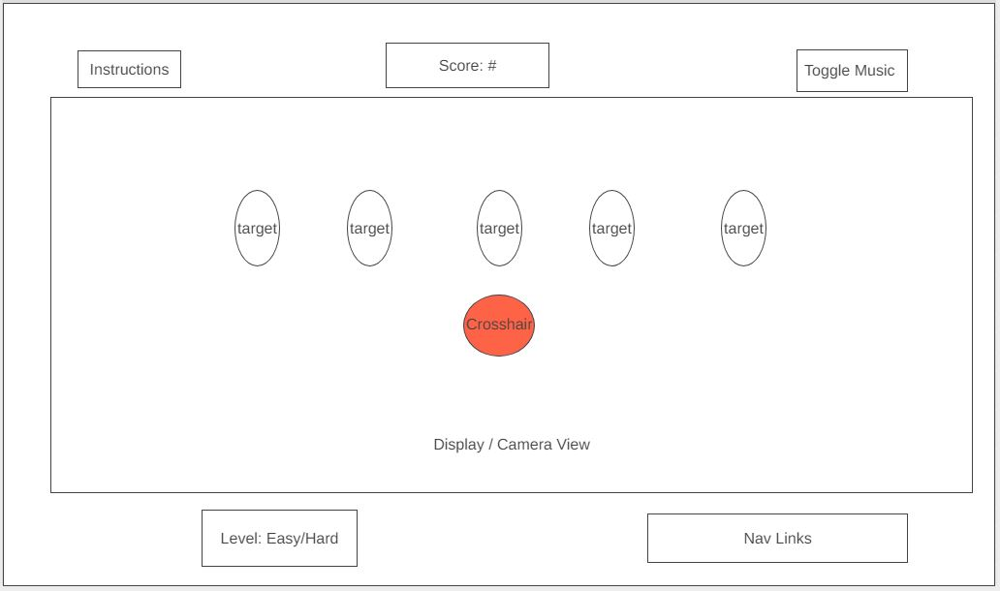

# Background

This is a first person shooter aim trainer for tactical shooting games using keyboard and mouse. The application allows you to practice aiming at a target using your mouse

The game initializes to the starting menu. The user can start the game, open instructions, and toggle music. After clicking start, there will be a short time period until targets appear one by one on the screen. They disappear after a set amount of time has passed or after being "shot" (clicked on by the mouse / shot with a bullet). After a set number of targets have come and gone, the game will end with results displaying user accuracy.

# Functionality & MVPs
In Target Practice, users will be able to:

- Start the game.
- Shoot targets.
- Visually confirm successful target hit.
- Analyze performance after the round is over (after a certain number of targets have come and gone).

In addition, this project will include:
- Ability to toggle between easy mode (slow targets) and hard mode (fast targets).
- Instructions about the game.
- Ability to toggle music sound on / off.

# Wireframe

- Nav links include links to this project's Github repository, my LinkedIn, and Angel link
- Score shows the number of targets successfully hit, updated in real time
- The Crosshair will be a lot smaller than shown in the wireframe
- Toggle between easy/hard mode
- Targets appear one by one, in any of the possible target elements shown

# Technologies, Libraries, APIs

- This project will be implemented with the following technologies: 
    + Canvas to render objects in the application
    + Use three.js to create the first person view point and user to target perspective

# Implementation Timeline
- Friday Afternoon & Weekend: Setup project, including getting webpack up and running, set up three.js. Render first person view point. Start building components in the POV like hand/gun that remains static as mouse moves.

- Monday: Continue working on objects in camera frame(hand/gun). Start user functionality: interaction with targets. 

- Tuesday: Continue work on functionality. Start menu overlay and gameover/results overlay.

- Wednesday: Finalize functions/pages. Work on customization/design.

- Thursday Morning: Deploy project to GitHub Pages/Heroku