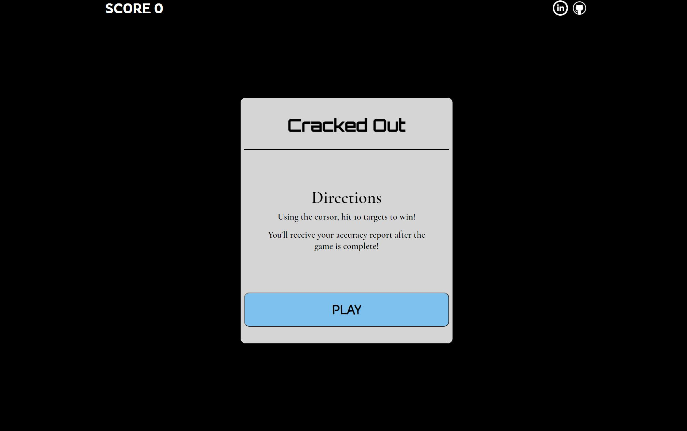
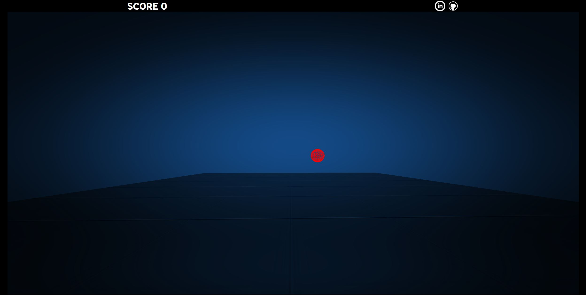
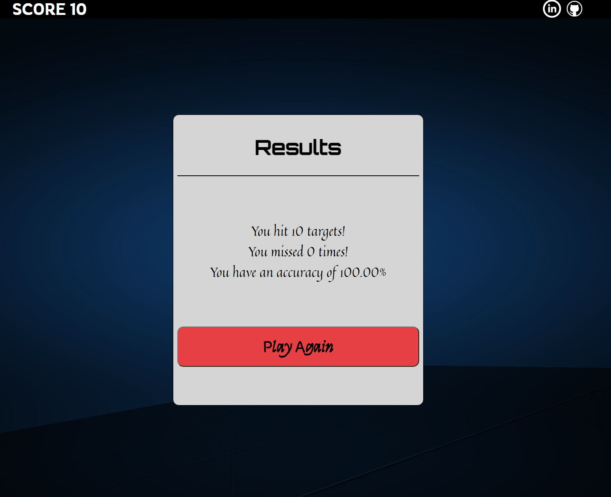

# Background

Wanting to improve your skills is universal, even gamers. Cracked Out provides mouse training for tactical shooter gamers in the form of a fun and interactive game. Hit all of the targets to receive a report of your accuracy, then keep playing the game to improve that number!

After starting the game, targets will continue to appear on the screen at random. A score counter updates as you successfully hit each target. After 10 successful target hits, the game ends, calculating how accurate your mouse skills are.

# Technologies, Libraries, APIs

- This project implements the following technologies: 

    + HTML, CSS, Javascript as the foundation of the web application 
    + Three.js to render the environment, first person point of view and target objects. 
        - WebGL is used in Three.js' underlying system
    + WebPack to bundle the Javascript and CSS


# Functionality & MVPs

- In Cracked Out, users will be able to:

    + Start the game
    + Hit targets
    + Confirm target hit with score increase


- In addition, this project will include:
    + Instructions about the game
    + A results page, analyzing user performance after the round is over


# Game Snippets





# Technical Challenges
- Challenge: 
    + Creating the basic function of allowing a user to destroy a target proved challenging under the three.js environment. There are several ways to incorporate user interaction with objects however specifically destroying the target object while creating a new one at the same time without refreshing the screen seemed nearly impossible.
    
- Solution: 
    + I had came across the topic of ray casting before and after trying various API's and library add-ons, I gave it a serious try. It allowed me to send a "signal" from the mouse click into the render and successfully delete the object as a user. Additionally, by adding userData to the target, I was able to specifically delete the target rather than any object in the render that I clicked on. 

```js
    function hitTarget() {
        raycaster.setFromCamera(pointer, camera);
        let intersects = raycaster.intersectObjects(scene.children);
        if (intersects.length > 0 && intersects[0].object.userData === "target") {
            scene.remove(intersects[0].object)
            createTarget();
            stats.hit += 1;
            stats.total += 1;
            document.getElementById('score').innerHTML = "SCORE " + stats.hit;
            if (stats.hit === finish) {
                const gameover = document.getElementById('results')
                gameover.classList.add('active');
                overlay.classList.add('active')
                document.getElementById('hits').innerHTML = "You hit " + finish + " targets!";
                document.getElementById('misses').innerHTML = "You missed " + (stats.miss - 1) + " times!";
                document.getElementById('percent').innerHTML = "You have an accuracy of " + (stats.hit /(stats.total - 1) * 100).toFixed(2) + "%"; 
            }
        } else {
            stats.miss += 1;
            stats.total += 1;
        };
    };

    document.addEventListener('click', hitTarget);
```

# Future Direction
- Customization to allow user to adjust the number of targets that appear
- Timer so that targets automatically removed if user does not it fast enough
- Camera movement smoothening for higher quality gameplay 
